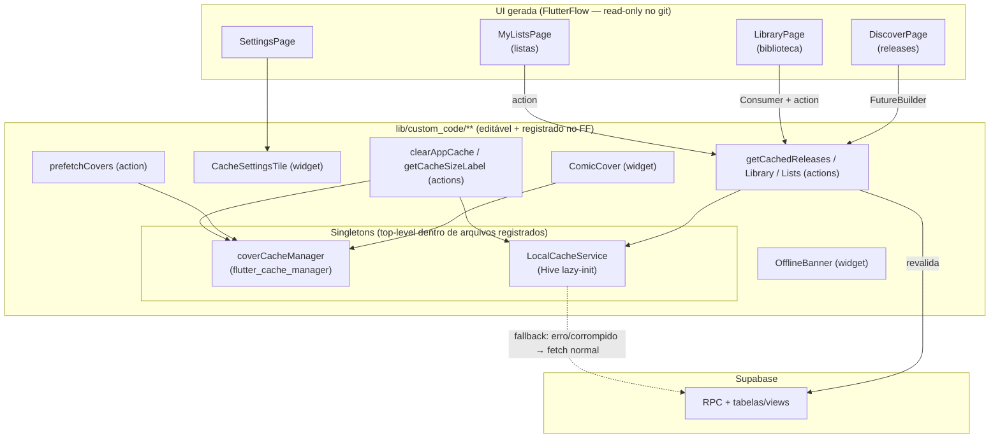
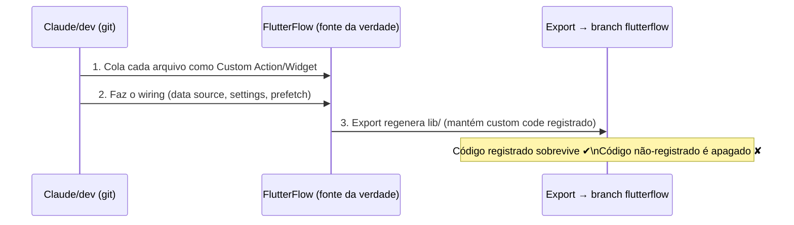
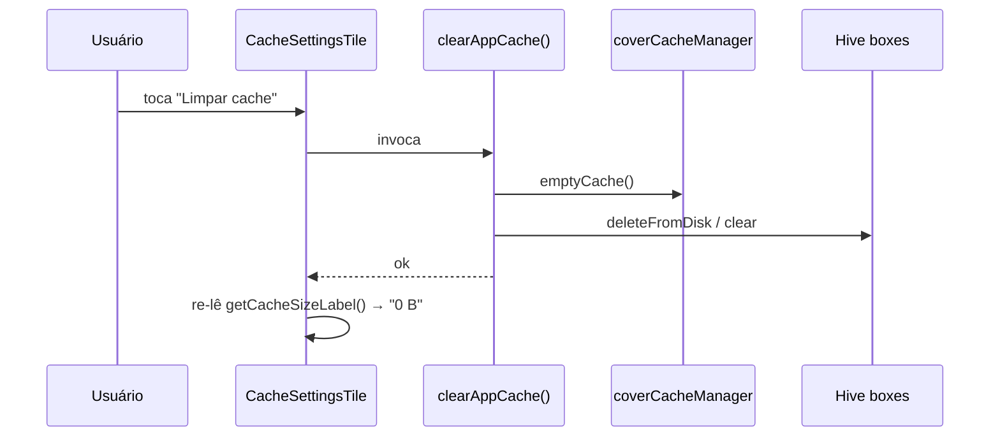
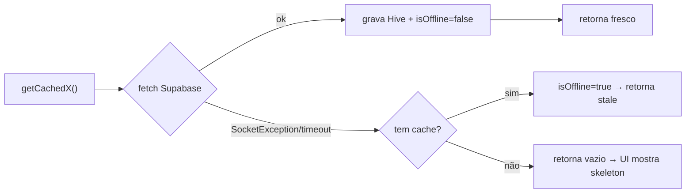

# Design — Camada de Cache Coesa (Gibifolio)

> Acompanha `spec.md`. Foco: **como** implementar sem perder nada no ciclo FlutterFlow.

## 1. Arquitetura em uma figura



## 2. Protocolo de Preservação (a regra que governa tudo)

O branch `flutterflow` recebe exports **wholesale**: o FlutterFlow regenera `lib/` a partir do
projeto dele. Portanto:

> **Fonte da verdade = projeto FlutterFlow, não o git.** Código que não estiver registrado no FF é
> apagado no próximo export.

**Regras operacionais:**
1. **1 arquivo ⇄ 1 registro no FF.** Cada `.dart` novo é um Custom Action **ou** Custom Widget
   registrado no FlutterFlow (Spec CON-02).
2. **Singletons viajam dentro de um arquivo registrado.** `coverCacheManager` e `LocalCacheService`
   são classes/variáveis top-level no mesmo arquivo de uma action registrada; arquivos vizinhos
   importam direto (`import '/custom_code/actions/<arquivo>.dart';`). Esse import fica no corpo
   editável (abaixo do banner `// DO NOT REMOVE`), que o FF preserva.
3. **Sem helper solto.** Nada de `lib/custom_code/cache/util.dart` desacoplado — o FF não conhece,
   então apaga.
4. **Wiring é no FF.** Trocar fonte de dados de `FutureBuilder`, inserir widget no settings, chamar
   `prefetchCovers` numa página: tudo é ação manual no FlutterFlow (§8).
5. **Round-trip checklist.** Ao final de cada frente, preencher o checklist (§6) com o tipo de
   registro de cada arquivo, para o humano replicar no FF.



## 3. Decisões de armazenamento

| Camada | Tecnologia | Por quê | Pacote (já no pubspec) |
|---|---|---|---|
| Imagens (capas) | `CacheManager` customizado | política explícita + store em disco | `flutter_cache_manager`, `cached_network_image` |
| Dados (releases/biblioteca/listas) | **Hive** (boxes) | structs serializam para JSON (`toSerializableMap`); rows Supabase já são `Map` | `hive` |
| Caminho do Hive | `Hive.init(dir.path)` | **`hive_flutter` NÃO está no pubspec** → não usar `initFlutter()` | `path_provider` |
| Tamanho em disco | varredura de arquivos | somar tamanho do dir de cache de imagem + arquivos de box Hive | `path_provider`, `dart:io` |

**Init lazy do Hive (NFR-02):** `main.dart` é gerado, então não há ponto de bootstrap editável.
`LocalCacheService.ensureInit()` é idempotente (guarda um `Future` estático) e é chamado no início de
toda action de cache:

```
static Future<void>? _initFuture;
static Future<void> ensureInit() => _initFuture ??= _doInit();
static Future<void> _doInit() async {
  final dir = await getApplicationDocumentsDirectory();
  Hive.init('${dir.path}/gibifolio_cache');
  // abrir boxes sob demanda em read/write
}
```

## 4. Modelo de dados do cache (envelope)

Cada entrada é guardada com metadado de tempo para o TTL:

```
// Guardado no box (JSON puro):
{
  "cachedAt": 1718500000000,   // epoch ms (passado por parâmetro — Date.now é evitado em libs puras)
  "v": 1,                       // versão do schema do envelope (para migração futura)
  "data": [ {...}, {...} ]      // lista de toSerializableMap() / row.data
}
```

- **releases** → cada item é `RecentReleasesCacheRow.data` (já é `Map<String,dynamic>` do Supabase) →
  reconstrói com `RecentReleasesCacheRow(map)`.
- **biblioteca** → cada item é `LibraryTitleItemStruct.toSerializableMap()` →
  `LibraryTitleItemStruct.fromSerializableMap(map)`.
- **listas** → análogo ao struct/row correspondente.

Leitura tolerante a corrupção (NFR-01): qualquer exceção no parse → trata como "miss" e segue para
fetch normal; opcionalmente `evict(key)` para limpar a entrada ruim.

## 5. Stale-While-Revalidate — dois padrões (honesto sobre o FF)

O `FutureBuilder` gerado emite **um** valor; SWR "vivo" (stale → fresh na mesma tela) exige a UI
ligada a um campo observável. Por isso, dois padrões:

- **Padrão A — App-state backed (SWR vivo):** biblioteca e listas. A action seta o campo do
  `FFAppState` (ex.: `libraryTitles`) com o cache na hora, retorna, e o revalidate em background
  atualiza o **mesmo** campo → telas ligadas via `Consumer`/`watch` re-renderizam com o dado fresco.
- **Padrão B — FutureBuilder backed (stale instantâneo + persistência):** releases. A action retorna
  o cache imediatamente; o revalidate em background grava no Hive para a **próxima** abertura ser
  fresca, e seta `needsLibraryRefresh`/flag para forçar `overrideCache` quando fizer sentido.

> Recomendação de wiring (§8): ligar biblioteca/listas pelo Padrão A (campos de `FFAppState` que já
> existem) e releases pelo Padrão B.

## 6. Inventário de componentes ⇄ registro no FlutterFlow

> Esta tabela **é** o checklist de round-trip (Spec CON-04 / AC-05).

> **As-built** (o que foi de fato implementado). Use esta tabela ao registrar no FlutterFlow.

| # | Arquivo (git) | Registrar no FF como (função) | Frente | Atende |
|---|---|---|---|---|
| 1 | `actions/cover_cache_manager.dart` | **Custom Action** `ensureCoverCache` (+ singleton `coverCacheManager`) | 1 | FR-IMG-01 |
| 2 | `widgets/comic_cover.dart` *(editar)* | **Custom Widget** (já existe) — repostar código | 1 | FR-IMG-02/03/04 |
| 3 | `actions/prefetch_covers.dart` | **Custom Action** `prefetchCovers` | 1 | FR-IMG-05 |
| 4 | `actions/local_cache_service.dart` | **Custom Action** `ensureLocalCache` (+ classe `LocalCacheService`) | 2 | FR-DATA-01, NFR-01/02 |
| 5 | `actions/get_cached_releases.dart` | **Custom Action** `getCachedReleases` | 2/3 | FR-DATA-02, FR-OFF-01 |
| 6 | `actions/get_cached_library.dart` | **Custom Action** `getCachedLibrary` | 2/3 | FR-DATA-03, FR-OFF-01 |
| 7 | `actions/get_cached_lists.dart` | **Custom Action** `getCachedLists` | 2/3 | FR-DATA-04, FR-OFF-01 |
| 8 | `actions/connectivity_state.dart` | **Custom Action** `ensureConnectivityState` (+ `isOfflineNotifier`/`markOffline`/`markOnline`/`isOfflineError`) | 3 | FR-OFF-01/03 |
| 9 | `widgets/offline_banner.dart` | **Custom Widget** `OfflineBanner` | 3 | FR-OFF-02 |
| 10 | `actions/invalidate_title_caches.dart` | **Custom Action** `invalidateTitleCaches` | 4 | FR-INV-02 |
| 11 | `actions/clear_app_cache.dart` | **Custom Action** `clearAppCache` | 4 | FR-INV-03 |
| 12 | `actions/get_cache_size_label.dart` | **Custom Action** `getCacheSizeLabel` | 4 | FR-INV-04 |
| 13 | `widgets/cache_settings_tile.dart` | **Custom Widget** `CacheSettingsTile` | 4 | FR-INV-05 |
| 14–21 | 8 actions de status *(editar)* — `update_reading_status`, `update_ownership_status`, `upsert_issue_status`, `upsert_title_status`, `update_title_reading_status`, `update_title_ownership_status`, `bulk_update_issue_reading_status`, `bulk_update_issue_ownership_status` | **Custom Action** (já existem) — repostar; só ganharam `await invalidateTitleCaches(user.id, titleId);` antes do `return true;` | 4 | FR-INV-02 |
| — | `actions/index.dart` / `widgets/index.dart` | (automático ao registrar no FF) | — | — |

Imports cruzados (regra §2.2): `comic_cover.dart` e `prefetch_covers.dart` importam direto
`cover_cache_manager.dart`; as `get_cached_*` importam `local_cache_service.dart` +
`connectivity_state.dart`; as 8 actions de status chamam `invalidateTitleCaches` via o
`import 'index.dart'` que já existe (sem import novo); `cache_settings_tile.dart` importa
`clear_app_cache.dart` + `get_cache_size_label.dart`.

**Desvios vs. plano (registrados):**
- Offline state via `ValueNotifier` em `connectivity_state.dart` (custom_code), **não** um App
  State `isOffline` no FF — evita editar `app_state.dart` (gerado) e é auto-contido.
- `clearAppCache` e `getCacheSizeLabel` em arquivos separados (1 arquivo = 1 action, idiomático FF).

## 7. Matriz de TTL e invalidação

| Dado | "Fresco" até (TTL) | Padrão SWR | Invalida quando |
|---|---|---|---|
| releases | 30 min | B | refresh manual / `needsLibraryRefresh` |
| biblioteca do usuário | sempre SWR; expiração dura 24 h | A | troca de status (lido/quero/tenho), refresh |
| listas do usuário | 1 h | A | criar/editar/excluir lista |
| metadados de título (detalhe) | 7 dias | A/B | troca de status **daquele** título |

> TTLs são defaults; ajustáveis num único ponto de constantes no `LocalCacheService`.

**Chaves de cache (namespacing):**
- `releases:recent`
- `library:<userId>`
- `lists:<userId>`
- `title:<titleId>`

Invalidação por status (FR-INV-02) → `evict('library:<userId>')` + `evict('title:<titleId>')` e
seta `needsLibraryRefresh = true` para forçar revalidação na próxima leitura.

## 8. Planilha de wiring no FlutterFlow (feito pelo humano, na UI do FF)

| Onde (página gerada) | Ação no FF | Atende |
|---|---|---|
| DiscoverPage → FutureBuilder de releases | trocar `requestFn` para chamar `getCachedReleases()` | FR-DATA-02 |
| LibraryPage | chamar `getCachedLibrary(uid)` no load; UI lê `FFAppState.libraryTitles` (Consumer) | FR-DATA-03 |
| MyListsPage | chamar `getCachedLists(uid)` no load | FR-DATA-04 |
| Listas/Biblioteca (scroll) | chamar `prefetchCovers([...próximas urls])` ao paginar | FR-IMG-05 |
| Scaffold das telas principais | inserir `OfflineBanner` no topo (auto-oculta quando online; estado vem do custom_code, **sem** App State) | FR-OFF-02 |
| SettingsPage | inserir `CacheSettingsTile` na seção apropriada | FR-INV-05 |

## 9. Fluxos-chave

**Limpar cache (FR-INV-03/04):**


**Offline read (FR-OFF-01/03):**


## 10. Riscos e incertezas (sinalizado, não fabricado)

- **[Incerteza] Preservação de arquivo no FF.** Confio que arquivos **registrados** como
  action/widget sobrevivem (é o mecanismo central do FF). **Não** confio em arquivos soltos — por
  isso a regra §2. Recomendação: validar com **um** ciclo de export após a Frente 1 antes de
  prosseguir, confirmando que `cover_cache_manager.dart` voltou intacto.
- **[Limitação] SWR no FutureBuilder.** SWR "vivo" só no Padrão A; releases (Padrão B) ganham
  "stale instantâneo + fresco na próxima". Documentado em §5 — sem overpromise.
- **[Limitação] Offline reativo.** Sem `connectivity_plus`, detectamos offline só ao **tentar** uma
  request (não há push de evento). Banner aparece após a primeira falha, não instantaneamente.
  Upgrade opcional registrado no spec (NFR-04).
- **[Atenção] `Date.now`/timestamps.** `cachedAt` usa tempo real do device dentro das actions (Dart
  normal permite). Apenas `custom_functions.dart` (funções puras) deve evitar efeitos — não usamos
  cache lá.

## 11. Ordem de implementação (1 frente por commit)

1. **Frente 1 — Imagens** (#1, #2, #3). `flutter analyze` + `flutter test` → diff → **OK** →
   *(opcional)* validar 1 ciclo de export.
2. **Frente 2 — Dados** (#4, #5, #6, #7).
3. **Frente 3 — Offline** (#8 + ajustes nas `get_cached_*`).
4. **Frente 4 — Invalidação/limpeza** (#9–#16 hooks, #17, #18).

Cada frente: implementa → `flutter analyze` (zero novos warnings) → `flutter test` → mostra diff →
preenche checklist de round-trip (§6) → aguarda OK antes da próxima.
